# Swagger Upgrade Workflow (Diagram)

End-to-end flow for upgrading a CLI extension (`cdn` or `front-door`) to a new swagger API version. See [aaz-dev-setup.md](./aaz-dev-setup.md) for the full step-by-step reference.

```mermaid
flowchart TD
    Start([User asks to upgrade swagger]) --> CheckRepos{"Repos + azdev venv ready?"}

    subgraph Prep[Prepare]
        CheckRepos -- No --> Bootstrap["initialize_aaz_dev_env.ps1<br/>create missing repos + venv"]
        CheckRepos -- Yes --> Verify["check_repos.ps1<br/>verify four repos"]
        Bootstrap --> Activate["use_aaz_dev_env.ps1<br/>activate env + AAZ_* paths"]
        Verify --> Activate
        Activate --> Branch["Create feature branches<br/>extension + aaz"]
        Branch --> Diff["swagger_diff.py<br/>old version -> new version"]
    end

    Diff --> ReviewDiff{{"Review swagger diff<br/>continue?"}}

    subgraph Workspace[Build AAZ Workspace]
        ReviewDiff --> StartUI["restart_aaz_dev.ps1<br/>open http://127.0.0.1:5000"]
        StartUI --> SelectResources["auto_select_resources.py<br/>add resources + inherit AAZ"]
        SelectResources --> PolishWorkspace["Fill short summaries<br/>Generate/fix examples"]
    end

    PolishWorkspace --> AutoExport{"Export AAZ + Generate CLI now?"}

    subgraph Generate[Export And Generate]
        AutoExport -- Yes --> ExportGenerate["auto_select_resources.py --auto-export<br/>Export workspace + generate CLI"]
        AutoExport -- No --> ManualReview{{"Review workspace in Web UI"}}
        ManualReview --> ManualExport{{"Manual Export<br/>user confirms"}}
        ManualExport --> GenerateCLI["generate_cli.py<br/>bump versions + generate CLI"]
    end

    ExportGenerate --> RunChecks
    GenerateCLI --> RunChecks

    subgraph Validate[Validate]
        RunChecks{"Run UT/tests + linter now?"}
        RunChecks -- Yes --> Checks["azdev test<br/>azdev linter"]
        RunChecks -- No --> SkippedChecks["Record checks skipped<br/>or run later"]
        Checks -- Fail --> Fix["Fix generated/custom issues"] --> RunChecks
        Checks -- Pass --> ReadyForVersion["Ready for version bump"]
        SkippedChecks --> ReadyForVersion
    end

    ReadyForVersion --> Bump["update_history.py<br/>bump setup.py + HISTORY.rst"]
    Bump --> Commit[["Commit changes<br/>extension + aaz"]]
    Commit --> End([Done])

    classDef script fill:#d4edda,stroke:#28a745,color:#000;
    classDef manual fill:#fff3cd,stroke:#ffc107,color:#000;
    classDef decision fill:#cfe2ff,stroke:#0d6efd,color:#000;
    class Bootstrap,Verify,Activate,Branch,Diff,StartUI,SelectResources,PolishWorkspace,ExportGenerate,GenerateCLI,Checks,Fix,ReadyForVersion,Bump script;
    class ReviewDiff,ManualReview,ManualExport manual;
    class CheckRepos,AutoExport,RunChecks decision;
```

## Legend

- **Green** — scripted step (invoke the named file under `.github/cdn-cli/scripts/`)
- **Yellow** — requires human review, confirmation, or action before generation (review swagger diff, click Export in the Web UI)
- **Blue** — conditional branch

## Script Index

| Script | Purpose |
|---|---|
| [initialize_aaz_dev_env.ps1](../scripts/initialize_aaz_dev_env.ps1) | One-time bootstrap: clone 4 repos + create azdev venv |
| [check_repos.ps1](../scripts/check_repos.ps1) | Lightweight verify that 4 repos exist (no clone) |
| [use_aaz_dev_env.ps1](../scripts/use_aaz_dev_env.ps1) | Activate venv + export env vars in a new terminal |
| [restart_aaz_dev.ps1](../scripts/restart_aaz_dev.ps1) | Launch / relaunch aaz-dev Web UI on port 5000 |
| [swagger_diff.py](../scripts/swagger_diff.py) | Compare two swagger API versions |
| [auto_select_resources.py](../scripts/auto_select_resources.py) | Create workspace with resources auto-selected; optionally Export AAZ + Generate CLI after prompting |
| [generate_cli.py](../scripts/generate_cli.py) | Bump command versions + PUT to trigger CLI code gen; optionally run tests + linter after prompting |
| [update_history.py](../scripts/update_history.py) | Bump `setup.py` VERSION + prepend `HISTORY.rst` entry |
