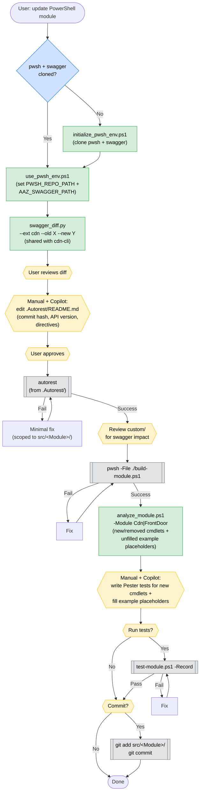

# AutoRest Module Maintenance Workflow (Diagram)

End-to-end flow for updating a CDN/AFD AutoRest-generated PowerShell module (`Cdn`, `FrontDoor`, etc.). See [autorest-generation.md](./autorest-generation.md) and [development.md](./development.md) for the full step-by-step reference.

## Legend

- **Green** — scripted step (invoke the named file under `.github/cdn-pwsh/scripts/`)
- **Grey** — external tool (autorest / build-module / test-module / git)
- **Yellow** — requires user decision or action
- **Blue** — conditional branch

## Script Index

| Script | Purpose |
|---|---|
| [initialize_pwsh_env.ps1](../scripts/initialize_pwsh_env.ps1) | One-time bootstrap: clone `azure-powershell` + `azure-rest-api-specs` |
| [use_pwsh_env.ps1](../scripts/use_pwsh_env.ps1) | Export `PWSH_REPO_PATH` + `AAZ_SWAGGER_PATH` in a new terminal |
| [analyze_module.ps1](../scripts/analyze_module.ps1) | Report new/removed cmdlets + unfilled example placeholders |

The swagger diff script lives in the sibling skill: [`.github/cdn-cli/scripts/swagger_diff.py`](../../cdn-cli/scripts/swagger_diff.py).
